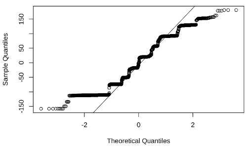
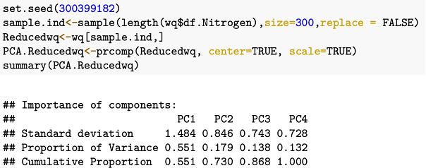

```{r setup, include=FALSE}
knitr::opts_chunk$set(echo = TRUE)
require(ggplot2)
require(ggthemes)
require(HDtest)
require(MASS)
require(rlang)
require(GGally)
require(klaR)
require(backports)
require(psych)
require(naivebayes)
require(cvms)
require(tibble)
require(ggord)
require(devtools)
set.seed(1234567890, kind="Mersenne-Twister")
```

## ABSTRACT
To model turbidity as a measure of river water quality using nitrogen content, phosphorus content, E.coli content, and types of surrounding land covers, we retrieve data from the Ministry of Environment which covers over 1000 rivers throughout New Zealand across 3 time periods and was collected in 2017, base on this set of data we conduct different statistical tests such as principal component analysis, linear discriminant analysis, and factor analysis to find out the relationships between variables. In conclusion, our study shows that there is a correlation between nitrogen and turbidity, and that phosphorus has changed linearly over the past years which is then proved to be valid for prediction. 


## INTRODUCTION

New Zealand as the number 14th country in the world with the cleanest water, (Tiseo, 2022) has always had a focus on maintaining water quality at a high standard. Having high-quality water is not only crucial to humans, as waterways also support a diverse range of plants and animals. (Why is water quality important?, 2022) There are large volume of observational studies and their corresponding data available around this topic, and we are interested in constructing models for water quality prediction based on different variables such as the content of waterborne bacteria, the concentration of trace elements within, time, and the surrounding environment, using data that were not collected for this purpose. By having a model as such, we will be able to produce reliable predictions on water quality using relevant elements and therefore deploy water treating schemes before the quality degrades, hence maintaining it at a high standard. 

In this study, we purpose that water quality can be quantified by variable Turbidity and predicted by the levels of 3 numerical variables: phosphorus, nitrogen, and E. coli, and different types of dominant land cover and different periods the measurements belong to. Turbidity refers to light scattering by suspended particles, E.coli plays as an indicator of human or animal faecal contamination, the percentage of change comes from the percent change in a water quality variable per year, (Scott Larned, 2018), and the dominant landcover describes the main landcover near the river.

In the following part of the report, we will test our hypothesis by exploring the correlation between variables, and conducting multiple statistical tests.

## METHODOLOGY

### Data Cleansing 
The raw data retrieved from the Ministry of Environment contains over 10,000 entry and 40 columns where the 1,000 rivers are recorded repeatedly for different variables and time. We first extracted the columns which contain information we need, and called this dataset "cleaned". 
Following the first extraction, we would likt to expand the "np_id_name" column which contained most of the useful variables we need. for example, to make turbidity of a river an individual column from the extracted dataset, we repeat this until all the useful variables are expanded and categorised to their own columns, by the same time.
After obtaining a wide format of data, we rename the columns and merge and stack them into one ready-to-use dataset.

### Exploratory Data Analysis 
The Exploratory Data Analysis is used for summarizing the variables, we also visualize variety plots to check if the dataset contains normal distributions and constant variance. 

The qqplot below shows a slight departure from the assumption of normality and constant variance. 
```{r qqplot,fig.cap="Normality Check"}

```

We found an interesting relationship from Coloured Histogram, both Nitrogen and Turbidity has a concided shape, there are strong evidence of a relevant relationship between Nitrogen and Turbidity.
```{r ColorHisto,fig.cap="Turbidity Vs. Nitrogen"}

```
We also found some differences in 3 periods of time across the waterquality.
```{r Pairsplot,fig.cap="Pairsplot for Turbidity and Nitrogen"}

```

### Principal Component Analysis 
EDA visualized a relevant connection between Turbidity and Nitrogen, which reminds us of the hypothesis regarding as a potential factor, if Nitrogen can affect the water quality in New Zealand? Therefore, we ran a Principal analysis among Turbidity and 3 potential factors to find more evidence. 

To apply the principal components, we used the function “prcomp” to load the PCA. 
Since too many observations could differ the useful visualizations, we reduced the sample of variables to 300.
```{r Reduced,fig.cap="Summary of PCA from Reduced data"}

```
Thereafter, we made a few biplots to see the relationship among principal components. Retrieving the ggbiplot for reduced data (300 samples), we can find the biplot interpretation:
1.	Larger cosine of angle of contributions between corresponding variables (Nitrogen and Turbidity) in a 2-dimension graphic.
2.	Observation points are closed to each other
3.	Similar direction of correlated variables

```{r biplotsAllPeriods,fig.cap="biplot from reduced data"}

```
We also plot corresponding variables in the year 2008, beside the interpretation we found from all periods, interpretation in the year 2008 is:

1.	The cosines of angle of contributions between corresponding variables (Nitrogen and Turbidity) are literally coincided in a 2-dimension graphic (smaller cosines than all periods)
2.	Observation points are closed to each other
3.	Similar direction of correlated variables

According to the biplots above ,we have corresponding variables Nitrogen and Turbidity has highly relevant and positive relationship.
```{r biplots08,fig.cap="Biplot for 2008 data"}

```

The ggpairs plot reveals correlations for 4 majority landcovers in New Zealand, but we do not find strong difference of water quality among 4 landcovers. Furthermore, comparing of other 2 variables, we find both Turbidity and Nitrogen has highly related curve. 

```{r ggpairs,fig.cap="Pairsplot for All Variables of Interest with Landcover Type"}

```


### Factor Analysis
We conduct factor analysis using different numbers of factos ranging from 0-3. Although p-values show an increase trend from 0 to 3.44e-05, it is still too small to not reject the null hypothesis to conclude a valid factor analysis. 

### Linear Discriminant Analysis

```{r, echo=FALSE, include=FALSE}
data <- read.csv("../Data/LDA.csv")

as.factor(data$Turbidity)
as.factor(data$Nitrogen)
as.factor(data$E.Coli)
as.factor(data$Phosphorus)
data$period <- as.factor(data$period)
```
```{r}
summary(data)
```

Pairs plot

```{r pairs, message=FALSE, fig.cap="Pairs plot of river health indicators throughout the three periods; 1990-2017 (red), 1998-2017 (green) and 2008-2017 (blue)"}
pairs.panels(data[, -5],
gap=0,
bg=c("red", "green", "blue")[data$period],
pch=21)
```

We can see scatterplots of each combination of variables and their correlation coefficients. Observations seem to be grouped into periods, however, some pairs of variables exhibit overlap between periods. Turbidity and nitrogen appear to have the highest correlation of 0.50 (Fig8). 

The data was split into subsets of 60% and 40% of the data, to be used as training and testing data, respectively. 
```{r}
set.seed(1234567890, kind="Mersenne-Twister")
ind <- sample(c("Train", "Test"), 
               nrow(data), 
               replace=TRUE, 
               prob=c(0.6, 0.4))
Train <- data[ind=="Train",]
Test <-  data[ind=="Test",]
```

## Linear Discriminant Analysis
 
```{r LDA}
(LDA <- lda(period ~ Turbidity+Nitrogen+E.Coli+Phosphorus, data=Train))
```

The estimates of prior probabilities show that 22.89% of the training data corresponds to the period 1990-2017, 33.28% to the period 1998-2017, and 43.83% to the period 2008-2017.

The coefficients of the linear discriminant functions show the linear combinations of predictor variables comprising the LDA. 
LD1 = 0.003xTurbidity + 0.002xNitrogen + 0.0067xE.Coli + -0.025xPhosphorus. Phosphorus appears to be the greatest contributor to LD1. 
LD2 = -0.006xTurbidity + 0.002xNitrogen + -0.02xE.Coli + 0.0025xPhosphorus. 

The proportion of the trace shows that 99.65% of variance between periods can be explained by the first Linear Discriminant (LD1), and 0.35% by the second Linear Discriminant (LD2). 

```{r, fig.cap="Separation between periods 1990-2017, 1998-2017 and 2008-2017 for each Linear Discriminant"}
Pred <- predict(LDA)
par(mar=c(1,1,1,1))
ldahist(data=Pred$x[,1], g=Train$period)
ldahist(data=Pred$x[,2], g=Train$period)
```

For LD1, there is large separation and little overlap between periods, reflecting 99.65% separation (Fig10). Conversely, we can see that there is little separation (0.35%) and substantial overlap between periods in LD2.

```{r ggord,fig.cap="LD1 and LD2"}

```

We can see that three clusters of observations exist, indicating the three time periods. However, there is some overlap on the right side, in which observations in periods 1990-2017 and 1998-2017 overlap with the cluster for 2008-2017. (Fig11) 


```{r, partition plot, fig.cap="Partition Plot using the training data for river health observations over the three periods; 1990-2017, 298-2017 and 2008-2017"}
partimat(period~., data=Train, method="lda")
```

The partition plot displays the classification of each observation in the training dataset, based on the LDA model, for each pair of variables. The top row exhibits much greater error rates (>0.5), indicating the greater occurrence of observations predicted to be in the incorrect periods. The bottom row, interestingly all pairs including phosphorus, shows much smaller error rates, indicating a lower amount of observations falling outside their predicted period (Fig12). 

```{r RealisticConfusionMatrixLDA, fig.cap="Realistic Confusion Matrix for the LDA using testing data for river health observations over three periods 1990-2017, 2998-2017 and 2008-2017"}
#Optimistic
Optimistic <- predict(LDA, Train)$class
(OCM <- table(Optimistic, Actual=Train$period))
sum(diag(OCM))/sum(OCM)
#Confusion matrix using test data
Realistic <- predict(LDA, Test)$class
(RCM <- table(Realistic, Actual=Test$period))
sum(diag(RCM))/sum(RCM)
RCM <- data.frame(RCM)

#Tibble for test data
tab_fin_test=as_tibble(RCM)
colnames(tab_fin_test)=c("Target", "Prediction", "N")
plot_confusion_matrix(tab_fin_test, target_col = "Target",
  prediction_col = "Prediction",
  counts_col = "N")
```

Predictions using the LDA model proved to be 92.4% accurate. 

The realistic confusion matrix using the test data shows that of all the observations where the target is 2008-2017, 84.8% were predicted correctly, 9.3% were predicted to belong to the period 1998-2017 and 5.9% to 1990-2017. However, 100% of the observations were correctly predicted for the targets 1998-2017 and 1990-2017.

Of all observations where the prediction is 2008-2017, 100% of them were actually 2008-2017. Where the prediction is 1998-2017, 14% of observations were from 2008-2017 and 86% were actually from 1998-2017. Finally, where the prediction was 1990-2017, 12.2% of observations were 2008-2017 and 87.8% were actually from 1990-2017.

## Maximum Likelihood Classification Model (Naïve Bayes)

```{r}
set.seed(1234567890, kind="Mersenne-Twister")
(model <- naive_bayes(period ~ Turbidity+Nitrogen+E.Coli+Phosphorus, data = Train, usekernel = T))
```

```{r, warning=FALSE, fig.cap= "Realistic Confusion Matrix using Maximum Likelihood Classification for periods using river health indicators"}
#Optimistic
Optimistic <- predict(model, Train)
(OCM <- table(Optimistic, Actual=Train$period))
sum(diag(OCM))/sum(OCM)
#Confusion matrix using test data
Realistic <- predict(model, Test)
(RCM <- table(Realistic, Actual=Test$period))
sum(diag(RCM))/sum(RCM)
RCM <- data.frame(RCM)

#Tibble for test data
tab_fin_test=as_tibble(RCM)
colnames(tab_fin_test)=c("Target", "Prediction", "N")
plot_confusion_matrix(tab_fin_test, target_col = "Target",
  prediction_col = "Prediction",
  counts_col = "N")
```

We can see that using Maximum Likelihood Classification (or Naïve Bayes), we achieve similar accuracy to the LDA model. This model achieved a 96.48% accuracy in predicting the time period of observations using the river health indicators, which is a higher accuracy rate than the LDA model (92.4%). 

The realistic confusion matrix shows that 93.4% of observations with the target of 2008-2017 were predicted as such, 1.4% falsely predicted for 1998-2017 and 5.2% as 1990-2017. For the target of 1998-2017, 100% of observations were predicted correctly. With 1990-2017 as the target, 1990-2017, 2.5% of observations were falsely predicted as 2008-2017, and 97.5% were correctly predicted. 

Observations predicted as 2008-2017, 98.7% of them were correct and 1.3% were actually belonging to 1990-2017. 1.9% of observations predicted as 1998-2017 were 2008-2017, and 98.1% were correctly predicted. Finally, 9.5% of observations predicted as 1990-2017 were instead 2008-2017 and 90.5% were correctly predicted. 

## CONCLUSION
Principal Component analysis reveals a highly relevant relationship between Nitrogen and Turbidity, since interpretation of biplots shows closesd angle between Nitrogen and Turbidity, in specifically period of 2008-2017, angle was nearly coincided, the correlation coefficient (cosine) was the largest out of 4 corresponding values, all angles among 4 variables are less than 90 degrees, therefore we can say nitrogen and turbidity are positive correlated, and Nitrogen can differ the water quality in New Zealand.
The linear discriminant analysis showed that with 92.4% accuracy, we could classify observations from our data into time periods using river health indicators, with phosphorus being the greatest contributor. However, the Maximum Likelihood Classification model proved to show greater accuracy in predicting periods of observations, with an accuracy rate of 96.48%. This indicates that distinct patterns of river health indicators exist for each of the periods 1990-2017, 1998-2017 and 2008-2017.  Thus, this shows that river health indicators could differ greatly over periods time.


## BIBLIOGRAPHY 
Scott Larned, A. W. (2018). Water Quality State and Trends in New Zealand Rivers. Christchunrch: Ministry for the Environment.

Tiseo, I. (2022, August 2). Leading clean waters scores worldwide as of 2021, by select country. Retrieved from Statista: https://www.statista.com/statistics/1143413/clean-water-index-region-globally/

Why is water quality important? (2022, August 10). Retrieved from ACT Government: https://www.environment.act.gov.au/water/act-healthy-waterways/water-quality/why-is-water-quality-important

