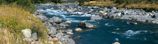
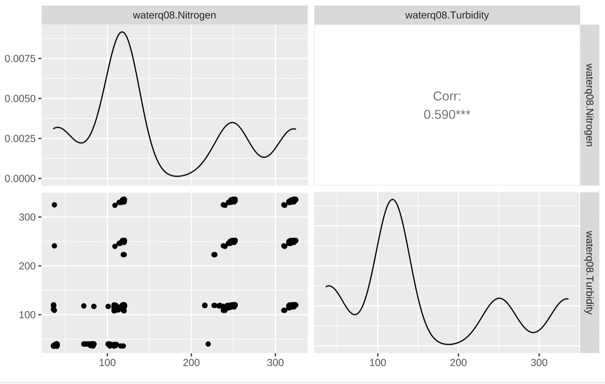
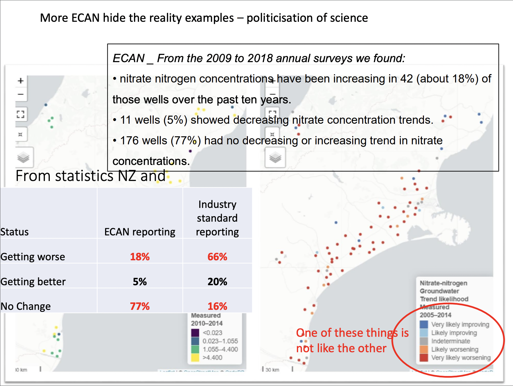

```{r setup, include=FALSE}
knitr::opts_chunk$set(echo = FALSE)
require(ggplot2)
```

## [[Group 6]{.underline}]{style="color:green"}

::: columns-2
<font size="5">[[**Angelina Chen**]{.underline}]{style="color:black"}

-   [Email: [angelinakejing\@outlook.com](mailto:angelinakejing@outlook.com){.email}]{style="color:black"}

-   [ORCID: 0000-0002-4925-2837]{style="color:black"}

[[**Ruibo (Ryan) Feng**]{.underline}]{style="color:black"}

-   [Email: [rynfenng\@gmail.com](mailto:rynfenng@gmail.com){.email}]{style="color:black"}

-   [ORCID: 0000-0002-2683-0921]{style="color:black"}

[[**Georgia Shanks**]{.underline}]{style="color:black"}

-   [Email: [georgiashanks19\@gmail.com](mailto:georgiashanks19@gmail.com){.email}]{style="color:black"}

-   [ORCID: 0000-0002-3227-7851]{style="color:black"}</font>

{width="50%"} {width="50%"} {width="50%"}
:::

## [[Our dataset]{.underline}]{style="color:green"}

<font size="5"> [**Target:** River water quality trends]{style="color:black"}

[**Location:** Throughout New Zealand]{style="color:black"}

[**Time:** 1990-2017, 1998-2017 and 2008-2017]{style="color:black"}

[**Indicators:** total nitrogen, total phosphorus, water clarity, turbidity, E.Coli, dominant landcover, trend]{style="color:black"}

[**Retrieved from:** Ministry for the Environment's database]{style="color:black"}

[**Our motivation:** We are passionate about environmental conservation. Important to perform analyses to determine what NZ needs to focus on to improve the health of our rivers.]{style="color:black"}</font>

<center></center>

## [[Visualisations of our data]{.underline}]{style="color:green"}

```{r, include=FALSE}
df<- read.csv("cleaned.csv")
unique(df$dominant_landcover)
unique(df$Trend)
unique(df$percent_annual_change)
```

```{r, fig.cap="Overall trends in river health over dominant land types of NZ rivers", echo=FALSE, warning=FALSE}
library(ggplot2)
ggplot(df)+
  geom_histogram(aes(x=dominant_landcover,fill=Trend),position = "dodge",stat="count", color='turquoise4')+
  labs(x="Dominant Landcover",y="Count",title="Distribution of Trend in Four Main Landcovers")
```

## [[Visualisations of our data]{.underline}]{style="color:green"}

```{r, warning=FALSE, fig.cap="Trends in NZ river health indicators", echo=FALSE}
original<- read.csv("riverquality.csv")
unstacked<- original[original$np_id_name==c("E. coli","Total phosphorus","Turbidity","Total nitrogen"),]
ggplot(unstacked)+
  geom_boxplot(aes(factor(percent_annual_change2,level=c('>2% worsening','1-2% worsening','0-1% worsening','0-1% improving','1-2% improving','>2% improving')),n_obs,fill=np_id_name))+
  labs(x="",y="Count",title="Element Distribution Across Annual Change Category",fill="Element")+
  theme(axis.text.x=element_text(angle=45,hjust=1))
```

## [[Interesting findings]{.underline}]{style="color:green"}

```{r, fig.cap="Histogram of turbidity (blue) vs. nitrogen (yellow)", echo=FALSE}
waterq08<-read.csv("rq08.csv", header=T)
df.wq08<-data.frame(waterq08$Nitrogen, waterq08$Turbidity)
hist(waterq08$Turbidity, col = "blue",  main="Turbidity vs Nitrogen", xlab='Turbidity')
hist(waterq08$Nitrogen, col= "yellow",add=TRUE)
```

## [[Interesting findings]{.underline}]{style="color:green"}

{width="80%"} <br> Pairs plot for nitrogen and turbidity in 2008

## [[Future steps]{.underline}]{style="color:green"}

-   <font size="4"><span style="color:black">Inspired by a previous report revealing a potential correlation between nitrogen and water quality, we are interested to see if turbidity can be one of the main indicators and provide statistical significance to this hypothesis.</span>

-   [Investigate trends in river water quality in different locations across New Zealand - How does spatial variation affect river water quality?]{style="color:black"} </font>

<center>{width="399"}</center>

<font size="2">Joy, M. (2019) [How we failed to protect freshwater in New Zealand;will the new government initiatives make adifference?](https://www.waternz.org.nz/Attachment?Action=Download&Attachment_id=4161)</font>
